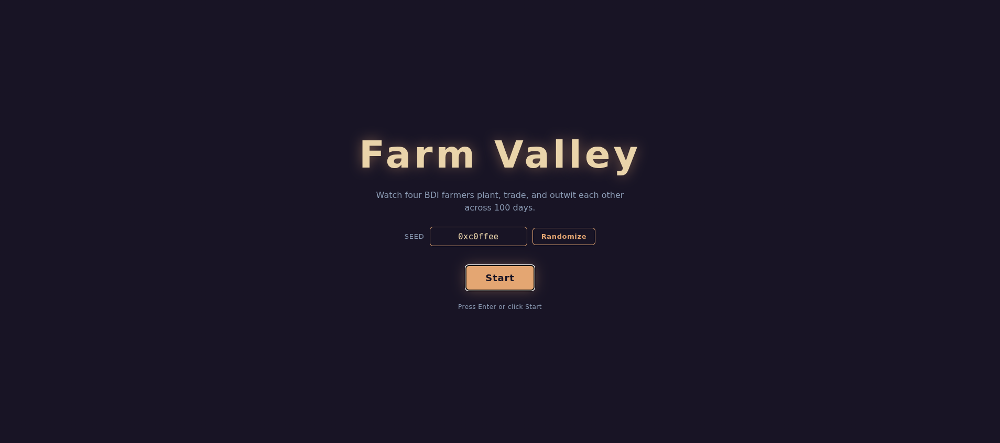
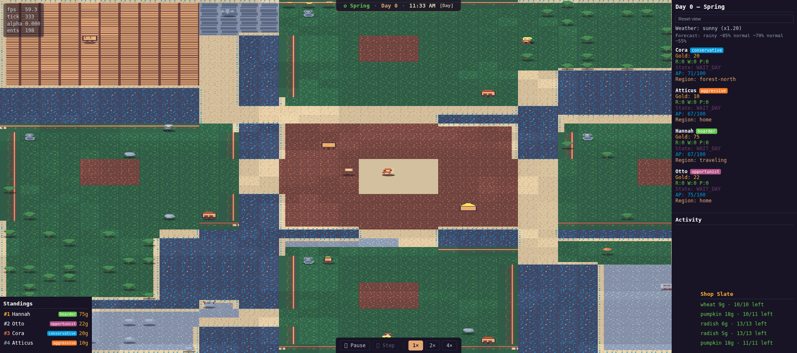

# Farm Valley

A tiny top-down farming sim where four AI farmers — each with their own personality — plant, harvest, trade, and try to out-earn each other across 100 in-game days. You don't play; you watch them play.

Built on a custom TypeScript game engine that uses an ECS (entity-component-system) core, a deterministic fixed-step game loop, a Canvas 2D renderer, and a WebAssembly pathfinder. The simulation runs in a Web Worker and streams render snapshots to the main thread. All art is drawn from a single 32-color palette ([EDG32](https://lospec.com/palette-list/endesga-32)), enforced across sprites, UI, and effects.




## Try it

Requirements: Node 20+ and npm.

```bash
npm install
npm run build-wasm   # one-time: compile the WASM pathfinder
npm run dev          # opens the game at http://localhost:5173
```

Click **Start** (or press Enter) on the home screen. The simulation runs on its own — sit back and watch the observer panel for live stats. When day 100 ends, a leaderboard pops up.

## Meet the farmers

| Farmer  | Personality   | Style                                           |
|---------|---------------|-------------------------------------------------|
| Cora    | conservative  | Plays it safe. Low risk, steady radish income.  |
| Atticus | aggressive    | Goes big on diverse crops, accepts losses.      |
| Hannah  | hoarder       | Keeps a fat gold reserve, plants when sure.     |
| Otto    | opportunist   | Adapts to weather and prices on the fly.        |

Each farmer is a [BDI agent](https://en.wikipedia.org/wiki/Belief%E2%80%93desire%E2%80%93intention_software_model) (Belief–Desire–Intention) that perceives the world, deliberates, and acts under an action-point budget per day.

## What's in the box

- **Weather & seasons** — a season/day clock drives forecasts; rain/drought changes crop yields, and a render-side day/night wash tints the world from dawn to dusk.
- **Market & shopkeeper** — farmers buy seeds and sell crops at supply-driven prices.
- **Mid-game shock** — a one-time blight strikes a random farmer around day 50, wiping their planted crops and reshuffling the standings.
- **Observer panel** — live readout of every farmer's gold, crops, FSM state, and remaining AP; click a farmer to focus the camera on them.
- **Leaderboard & activity feed** — live standings (color-coded by personality) plus a running log of meets, trades, and harvests.
- **Animated pixel art** — walk/work/idle animations, drop shadows, and particle bursts (coins, dirt, leaves), all drawn from the EDG32 palette.
- **Debug overlay** — tick count, render alpha, entity count.

## Art direction

Every color in the project — sprites, tiles, particles, the day/night wash, and all HTML/canvas UI — comes from the 32-color [EDG32 (Endesga-32)](https://lospec.com/palette-list/endesga-32) palette. The palette is a single source of truth in [packages/engine/src/render/palette.ts](packages/engine/src/render/palette.ts) (use the named `EDG.*` constants), and a guard test scans the whole source tree and fails CI on any off-palette color literal — so new assets stay on-palette by construction.

## Project layout

```
packages/
  engine/          shared engine (ECS, renderer, input, sim, wasm bindings)
  farm-valley/     the game (agents, systems, screens, UI panels, sim worker)
  wasm-modules/    AssemblyScript pathfinder compiled to WASM
tools/
  atlas-builder/   packs sprite source images into the runtime atlas
  run-sim/         headless simulation runner (no rendering)
  world-preview/   standalone world snapshot viewer
corpus/            design notes and TODO milestones
```

The game lives in [packages/farm-valley/src/](packages/farm-valley/src/). Notable bits:

- [main.ts](packages/farm-valley/src/main.ts) — boot, home → game wiring, render loop
- [worker/](packages/farm-valley/src/worker/) — the sim Web Worker, render-snapshot schema, and the main-thread client that interpolates + renders
- [screens/](packages/farm-valley/src/screens/) — full-screen views (home screen, game over, …)
- [ui/](packages/farm-valley/src/ui/) — in-game overlays (observer, debug, config)
- [agents/](packages/farm-valley/src/agents/) — one file per personality
- [systems/](packages/farm-valley/src/systems/) — ECS systems that run each tick

## Common commands

```bash
npm run dev          # run Farm Valley in the browser (hot reload)
npm run build        # production build of the game
npm run test         # vitest across all workspaces
npm run typecheck    # tsc --noEmit across all workspaces
npm run sim          # headless simulation (no browser)
npm run preview      # static world-snapshot viewer
npm run atlas        # rebuild the sprite atlas
npm run build-wasm   # rebuild the WASM pathfinder
```

## License

MIT — see [LICENSE](LICENSE).
