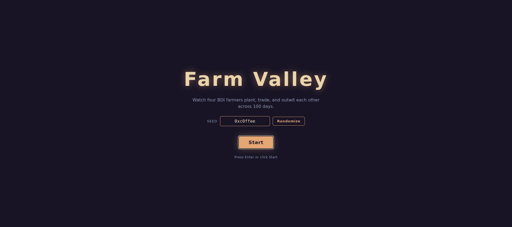
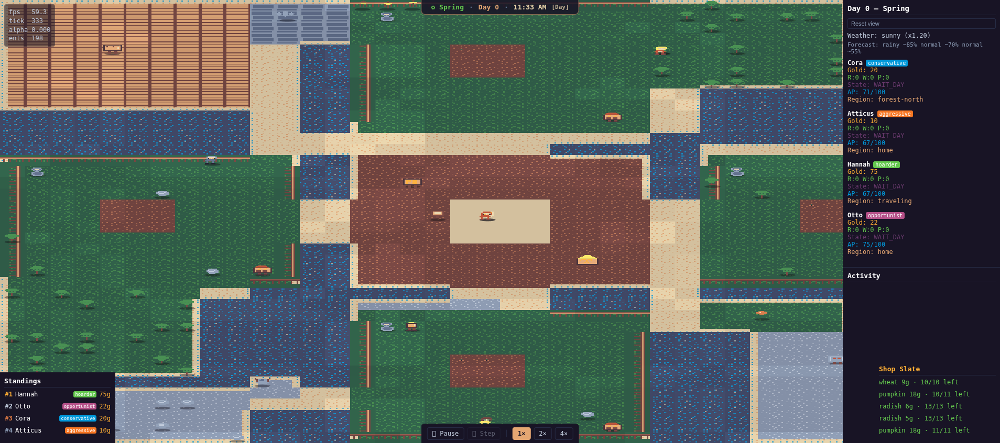

# Game Engine — four games, one TypeScript ECS core

A monorepo where the interesting part isn't any one game: it's the **generic, in-house TypeScript
engine** underneath, and the discipline that keeps it honest. An ECS, a deterministic fixed-step sim
loop, a WebGL2 renderer (2D *and* 3D), input, animation, and a WebAssembly pathfinder — consumed by
four independent games that never import each other.

The engine is game-agnostic by rule, not by hope: a test scans every workspace on disk and fails if
`@engine/core` ever reaches into a game, or if one game reaches into another.

## The four games

| Game | What it is | Sim runs | Run it |
|---|---|---|---|
| **Farm Valley** 🌾 | 21 farmers (20 BDI AI + the playable **Pip**) compete over 100 in-game days. Mostly a watch-it-play sim. | Node WebSocket **server** | `npm run dev` → :5173 |
| **Citadel** 🏰 | A cozy settlement sim — a placement puzzle you read by watching the town live. Threats dent happiness, never destroy. | in-browser **Web Worker** (plus a server for online MP) | `npm run citadel` → :5174 |
| **Hollow** 🌙 | A generational social-emergence sim / research instrument: needs, relationships, lineage, governance, mortality. The only **3D** game. | in-browser **Web Worker** | `npm run hollow` → :5175 |
| **MateQuest** 📐 | A Romanian-curriculum (**grades I–IV**) math roguelike where solving a problem *is* the combat action. UI defaults to Romanian. | in-browser **Web Worker** | `npm run mathquest` → :5176 |

## Try it

Requirements: **Node ≥ 24** and npm. (Pinned in `engines`; it matches the container the sim server
ships in.)

```bash
npm install
npm run dev          # Farm Valley: sim server + client at http://localhost:5173
```

`npm run build-wasm` is **not** needed after a clone — the WASM artifacts are committed.

`npm run dev` runs both halves of Farm Valley: the Node sim server (`@farm/server`, on `:8787`) and
the Vite client, which proxies the sim WebSocket to it. Click **Start** (or press Enter) on the home
screen; the simulation runs itself. When day 100 ends, a leaderboard pops up. The other three games
need no server — their sim runs in a Web Worker in the page.

## Farm Valley, in a bit more detail




A 240×240 seed-generated archipelago of rectangular islands, bridged by a spanning tree plus a few
loops. 21 farmers work it: five named (Cora, Atticus, Hannah, Otto, and Pip) plus sixteen
procedurally-placed archetype clones on their own farm islands.

| Farmer  | Personality   | Style                                           |
|---------|---------------|-------------------------------------------------|
| Cora    | conservative  | Plays it safe. Low risk, steady radish income.  |
| Atticus | aggressive    | Goes big on diverse crops, accepts losses.      |
| Hannah  | hoarder       | Keeps a fat gold reserve, plants when sure.     |
| Otto    | opportunist   | Adapts to weather and prices on the fly.        |
| Pip     | *you*         | A real farmer entity — intentions come from the keyboard. |

Each AI farmer is a [BDI agent](https://en.wikipedia.org/wiki/Belief%E2%80%93desire%E2%80%93intention_software_model)
(Belief–Desire–Intention) that perceives the world, deliberates, and acts under an action-point
budget per day. Every option — farming, fishing, foraging, mining — is scored in the same unit,
**gold per action point**, so non-farm work competes honestly with crops.

- **Weather & seasons** — a season/day clock drives forecasts; rain/drought changes yields, and a
  render-side day/night wash tints the world from dawn to dusk.
- **Market & shopkeeper** — farmers buy seeds and sell 8 crops (radish → grape) at supply-driven
  prices, plus a peer-to-peer market wall with escrowed offers.
- **Mid-game shock** — a one-time blight strikes a random farmer around day 50, wiping their planted
  crops and reshuffling the standings.
- **Observer panel** — live readout of every farmer's gold, crops, FSM state, and remaining AP; click
  a farmer to follow them.
- **Pip** — inspect card, drag-from-world hotbar, and a diegetic HUD, all drawn through the shared
  in-canvas `@engine/ui` toolkit. Movement is free; actions still obey AP, tool, and proximity rules.

## What makes it worth reading

- **Determinism is load-bearing.** All randomness flows through a seeded mulberry32 `Rng` with named
  `fork(label)` derivation. No `Math.random`, no `Date.now` in sim code — a tick's output depends
  only on the tick count, so **seed + params** fully describes a run and reproduces it byte-for-byte.
  There's no save-file model because there doesn't need to be one.
- **The sim never runs on the render path.** The ECS world and scheduler live behind a snapshot
  stream — in a server, a Worker, or a bare test — and the client interpolates between the latest two
  snapshots. `bootstrapSim()` stays transport-agnostic, which is why the same sim can be driven
  straight from a test with no browser and no server.
- **A fixed palette per game, with zero raw hex.** Every colour — sprites, tiles, particles, the
  day/night wash, HTML *and* canvas UI — comes from a named role constant.
  Engine + Farm use [EDG32](https://lospec.com/palette-list/endesga-32); Citadel and Hollow use
  Apollo-46; MateQuest uses Resurrect-64. A path-scoped guard test scans the tree (including HTML and
  CSS) and fails on any off-palette literal.
- **Assets are code.** Sprites are ASCII `PixelRecipe` grids baked into an atlas at build time, keyed
  on a content fingerprint; Citadel's buildings are in-code 3D meshes flat-shaded by a deterministic
  software rasterizer; the UI font is a vendored bitmap baked at boot. Byte-identical art on every
  machine.
- **WebGL2 is the only render backend** (Canvas2D and WebGPU were both deleted in 2026-08). Shaders
  are GLSL ES 3.00 and a per-directory lint enforces it.

## Repository layout

npm workspaces, grouped by the dependency seam:

```
engine/
  core            @engine/core          generic ECS engine (subpath exports: /ecs /render /sim /runtime /input …)
  ui              @engine/ui            shared in-canvas UI toolkit (Farm, Citadel, MateQuest)
  wasm-modules    @engine/wasm-modules  AssemblyScript kernels (pathfinder, noise, rng, floodfill)
games/
  farm/           sim-core · client · server · atlas-recipes
  citadel/        sim-core · client · server
  hollow/         sim-core · client
  mathquest/      sim-core · client
tools/
  run-sim         headless deterministic Farm sim (no browser, no server)
  citadel-sim     headless Citadel sim
  hollow-sim      headless Hollow sim (+ metrics / chronicle export)
  world-preview   renders the Farm world/atlas to a PNG
  atlas-builder   builds the sprite atlas from pixel recipes
corpus/           the project's living design wiki (source of truth for intent)
docs/             a Starlight docs site: authored showcase + the corpus rendered
infrastructure/   the sim server's container build
```

**Dependency rule (enforced):** `@engine/wasm-modules` → `@engine/core` → the four `sim-core`
packages → their matching clients and servers. Nothing points upward.

Notable Farm entry points: [main.ts](games/farm/client/src/main.ts) (boot, home → game, render loop),
[net/sim-client/](games/farm/client/src/net/sim-client/) (the WebSocket client that interpolates and
renders snapshots), [agents/](games/farm/sim-core/src/agents/) (one file per personality),
[systems/](games/farm/sim-core/src/systems/) (the ECS systems that run each tick).

## Commands

```bash
# run a game
npm run dev          # Farm Valley: sim server + client (vite :5173)
npm run server       # just the Farm sim server (WebSocket :8787)
npm run citadel      # Citadel: server (:8788) + client (:5174); add ?mp for online MP
npm run hollow       # Hollow client (:5175)
npm run mathquest    # MateQuest client (:5176)

# check it
npm run typecheck    # tsc --noEmit across all workspaces
npm run test         # vitest across all workspaces
npm run gates        # the full sequence: typecheck → test → build → four startup smokes → pack-smoke
npm run pack-smoke   # pack @engine/* and install the tarballs into examples/library-consumer

# headless / offline
npm run sim          # deterministic Farm sim, no browser and no server
npm run sim:citadel  # headless Citadel sim
npm run sim:hollow   # headless Hollow sim (+ metrics / chronicle export)
npm run preview      # render the Farm world to a PNG
npm run atlas        # rebuild the sprite atlas
npm run build-wasm   # rebuild the WASM kernels (commit the artifacts)
npm run docs         # build the documentation site
```

**There is no hosted CI.** `npm run gates` *is* the gate sequence — it keeps going after a failure and
exits non-zero with the list. The startup smokes are the point: typecheck and tests both stayed green
through a `.glsl` import break that threw on every real entry point.

Headless Farm sim knobs (env vars on `npm run sim`): `SEED`, `TICKS_PER_DAY` (default 1200),
`MAX_DAYS` (default 100), `EXPORT=csv|json`, `EXPORT_FILE`, and `CHECK_DETERMINISM=1` to run a seed
twice and assert byte-identical results. (`sim:hollow` takes `MAX_YEARS` instead.)

## Documentation

- **[corpus/](corpus/)** — the living, LLM-maintained design wiki, and the source of truth for
  *intent*: [index](corpus/index.md) · [architecture](corpus/wiki/architecture.md) ·
  [decisions](corpus/wiki/decisions.md) · [status](corpus/wiki/status.md) ·
  [glossary](corpus/wiki/glossary.md).
- **[docs/](docs/)** — a Starlight site that pairs an authored showcase with the durable corpus pages
  rendered straight from `corpus/`, so the deep detail can't drift from what the site claims.
- **[CLAUDE.md](CLAUDE.md)** — the orientation file for coding agents working in this repo.

## License

MIT — see [LICENSE](LICENSE).
