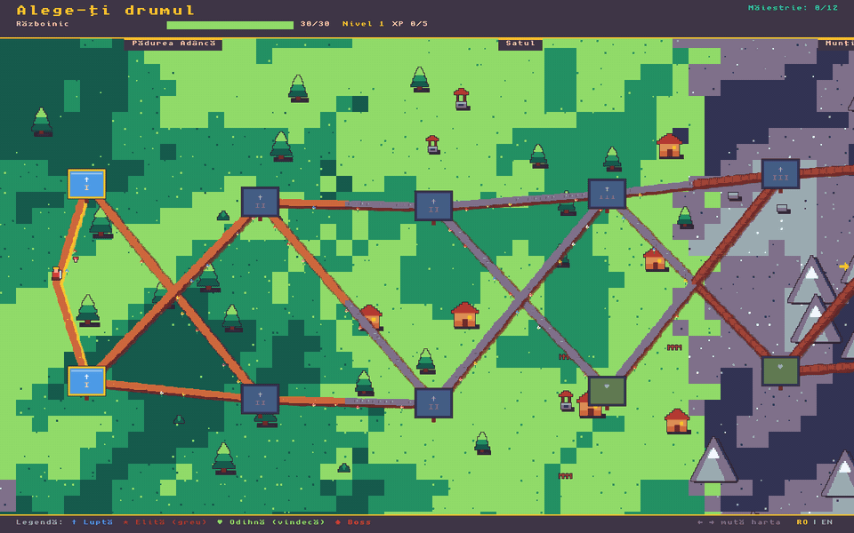
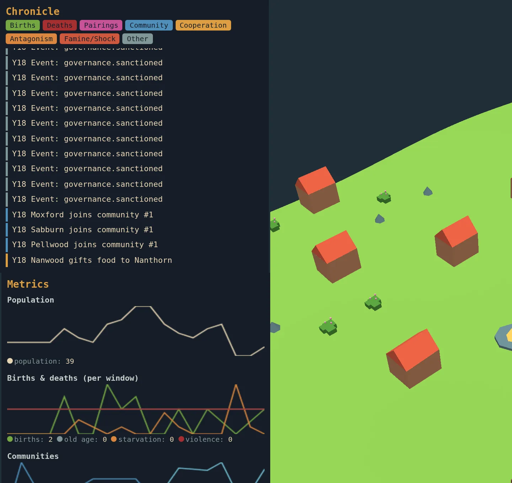
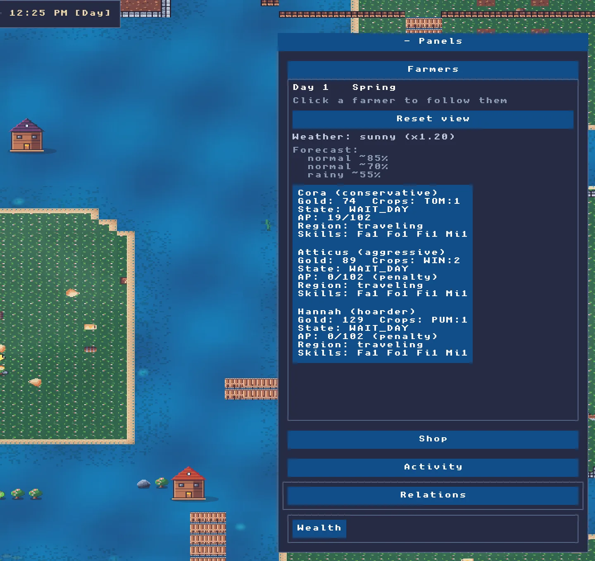

# Game Engine

An in-house TypeScript game engine and the four browser games built on it, kept in one monorepo. It is for readers who want to see how one deterministic simulation engine can carry very different games that never import each other.

<p align="center">
  
</p>
<p align="center"><sub>Top: Farm Valley, Citadel. Bottom: Hollow, MateQuest.</sub></p>

**Status:** Personal project, in active development since May 2026. Farm Valley, Citadel and Hollow are playable online; MateQuest runs locally only. The engine packages are used only inside this repo.

## What it does

- Runs four unlike games on one engine: a farming sim you mostly watch, a cozy settlement builder, a 3D sim of a society across generations, and a math roguelike for primary school.
- Replays any run exactly from its seed. Sim code may not call `Math.random` or `Date.now`, and a guard test fails if it does.
- Runs the sims headless, with no browser and no server. Tests drive the same code the games ship, and Farm Valley, Citadel and Hollow have command-line runners.
- Enforces its layering. The engine never imports a game and no game imports another; a test scans every workspace on disk and fails on a violation.
- Treats art as code. Sprites are ASCII pixel grids and Citadel's buildings are meshes written in code, all baked at build or boot time. Each game has a fixed palette, and a test fails on any colour outside it.

| Game | What it is | Play |
|---|---|---|
| Farm Valley | 21 farmers (20 BDI agents plus Pip, whom you can steer) compete for gold over 100 in-game days | [gandolh.ro/farm-valley](https://gandolh.ro/farm-valley/) |
| Citadel | A settlement builder: place buildings and roads, then watch the town live. In cozy mode setbacks pass; in challenge mode fire and raids can ruin you | [gandolh.ro/citadel](https://gandolh.ro/citadel/) |
| Hollow | A generational social sim and research tool: needs, relationships, lineage, governance, death. The only 3D game | [gandolh.ro/hollow](https://gandolh.ro/hollow/) |
| MateQuest | A roguelike on the Romanian grades I-IV math curriculum, where solving a problem is the attack. UI defaults to Romanian | `npm run mathquest` |

This is not a general-purpose engine. There is no editor, no published npm package and no API reference; the engine grows only as far as these four games need. If you want to ship your own game, Phaser or Godot will serve you better. If you want to read a small engine end to end, with the reasons for each decision written down, this is that.

## Screenshots

MateQuest: pick a path on the map, choose Attack, answer the problem, and the answer lands as damage.



| Hollow's chronicle and live metrics | Farm Valley's Farmers panel |
|---|---|
|  |  |

## How it works

The engine (`@engine/core`) has an ECS, a fixed-step sim loop, a WebGL2 renderer for 2D and 3D, input and animation. `@engine/wasm-modules` adds AssemblyScript kernels for pathfinding and noise, and `@engine/ui` draws the in-canvas UI. Each game splits into a `sim-core` package and a browser client. The sim never runs on the render path: Farm Valley's runs in a Node WebSocket server, the other three run in a Web Worker, and the browser draws from the snapshots the sim sends. Because a run depends only on its seed, a check is one command:

```console
$ CHECK_DETERMINISM=1 MAX_DAYS=5 TICKS_PER_DAY=20 npm run sim
Determinism check — 1 seed(s), 5 days @ 20 ticks/day (parallel, up to 2 workers)
  seed 0xc0ffee: MATCH (5 day snapshots, 21 farmers)
DETERMINISM CHECK PASSED — all seeds reproduced identically.
```

More on the docs site: [the engine](https://gandolh.ro/game-engine/docs/architecture/) and [patterns and techniques](https://gandolh.ro/game-engine/docs/patterns/). The full map is [corpus/wiki/architecture.md](corpus/wiki/architecture.md).

## Run it locally

Requires Node 24 or later and npm.

```bash
npm install
npm run dev          # Farm Valley: sim server on :8787, game on http://localhost:5173
npm run citadel      # Citadel on http://localhost:5174
npm run hollow       # Hollow on http://localhost:5175
npm run mathquest    # MateQuest on http://localhost:5176
```

In Farm Valley, click Start or press Enter and the farmers play themselves; Tab opens the leaderboard. The WASM files are committed, so a fresh clone needs no WASM build. Tests, the gate sequence, the headless sims and their settings: [docs/getting-started.md](docs/getting-started.md).

## Project layout

| Path | What lives there |
|---|---|
| `engine/` | `@engine/core` (ECS, sim loop, renderer, input), `@engine/ui`, `@engine/wasm-modules` |
| `games/` | One folder per game: `sim-core` and `client`, plus a `server` for Farm Valley and Citadel |
| `tools/` | Headless sims for Farm Valley, Citadel and Hollow, the Farm world preview, the atlas builder |
| `docs/` | The Starlight docs site, plus the guides and images this README links |
| `corpus/` | The design wiki: decisions, status, glossary and the work queue |
| `infrastructure/` | The container image for Farm Valley's sim server |
| `examples/` | An outside-the-workspace project that installs the packed engine libraries |
| `scripts/` | The dev runner and the gate sequence (`npm run gates`) |

## Docs

- [docs/](docs/README.md): getting started, the four games in more detail, and how each image here was made
- Docs site: <https://gandolh.ro/game-engine/docs/>, built from `docs/`
- Design wiki: [corpus/](corpus/index.md), with [decisions](corpus/wiki/decisions.md), [status](corpus/wiki/status.md) and the [glossary](corpus/wiki/glossary.md)
- [CLAUDE.md](CLAUDE.md): orientation for coding agents working in this repo

## License

[MIT](LICENSE)
